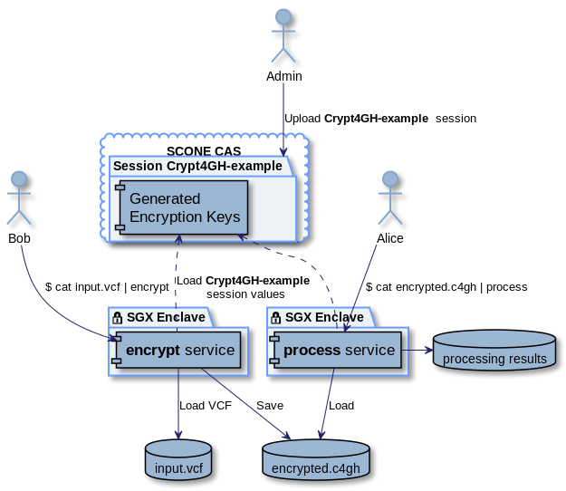

# Example of using the SCONE CAS as a key manager for Crypt4GH

This example provides two services:
* encrypt - to encrypt a VCF file, using a [Crypt4GH](https://github.com/EGA-archive/crypt4gh) Python library
* process - to process the encrypted file: extract the ID column.

Encryption keys are
* Generated by [SCONE Configuration and Attestation Service](https://sconedocs.github.io/glossary/#scone-cas)
* Not exposed to any users, including administrators
* Only visible inside particular Intel SGX enclaves.

## Requirements

* Docker access to the Scontain Registry https://sconedocs.github.io/registry/
* Docker and Docker Compose installed
* Build utilites installed: awk, curl, make, openssl

## Build

To build Docker services Docker image, generate and upload session to CAS, run:
    $ make

Build and start [SCONE Local Attestation Service](https://sconedocs.github.io/glossary/#scone-las) container:

    $ docker-compose up -d las

## Encrypt a file

    $ cat input.vcf | docker-compose run --rm encrypt > ./input.c4gh

## Process encrypted input

Run "process" service to extract VCF file ID's from the input:

    $ cat input.c4gh | docker-compose run --rm process 2>/dev/null

## Run example without Docker and SCONE, with explicit keys

    $ pip3 install -r requirements.txt
    $ export SENDER_KEY=aaaaaaaaaaaaaaaaaaaaaaaaaaaaaaaaaaaaaaaaaaaaaaaaaaaaaaaaaaaaaaaa
    $ export RECIPIENT_KEY=bbbbbbbbbbbbbbbbbbbbbbbbbbbbbbbbbbbbbbbbbbbbbbbbbbbbbbbbbbbbbbbb
    $ python app encrypt input.vcf | python app process

## References
* [Crypt4GH](https://github.com/EGA-archive/crypt4gh) - encryption utility
* [SCONE](https://scontain.com/) - a Secure Container Environment
* [VCFPy](https://vcfpy.readthedocs.io/en/stable/) - a Python 3 library with good support for both reading and writing VCF files
